[![IBM Cloud powered][img-ibmcloud-powered]][url-ibmcloud]
# Data Science-Lab 3
Aprende a desplegar un modelo de un Jupiter Notebook dentro de Watson Studio!!

Ojo: Esta es la parte 3 de 3 de nuestro taller de Data Science.

## Cupones para profesores y estudiantes:

* Acceder al portal de [IBM Academic Initiative][url-academic] y seleccionar la opción "Register now" si aun no tienes cuenta.
* Realizar el registro correspondiente utilizando la cuenta de correo académica y confirma tu cuenta.
* Despues de confirmar tu cuenta, y con la sesion iniciada en IBM Academic Initiative, en la parte de "Most Popular Topics covered", encontraremos **IBM Cloud** y damos clic en "Learn more".
* Bajamos de la pagina hasta encontrar "Software". Le damos clic, nos dara un apartado que se llama "Request Feature Code".
* Nos dara nuestro codigo. Lo copiamos y lo llevamos a **IBM Cloud**.

## Cargar créditos en IBM Cloud:

* En la parte superior derecha, buscaremos la parte de "MANAGE"/"GESTIONAR", nos desplegara una lista y seleccionaremos "Account"/"Cuenta".
* De lado izquierdo, tendremos una opción "Account settings"/"Configuracion de cuenta".
* Bajamos un poco hasta encontrar "Subscription and feature codes"/"Codigos de suscripción y carateristicas".
* Da clic en "Apply code"/"Aplicar codigo".
* Ingresamos el codigo y clic en "Apply"/"Aplicar".

## 9. Desplegar el modelo:
1.	Para realizar nuestro despliegue, vamos a nuestro proyecto en watson studio, y en la pestaña “Assets”, buscamos el apartado “Models”. Ahí debemos poder ver el modelo que recién creamos. Damos clic en el menú de “hamburguesa” (aparece al pasar el “mouse” sobre él) y seleccionamos la opción. “Deploy”.
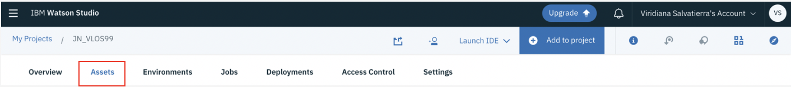
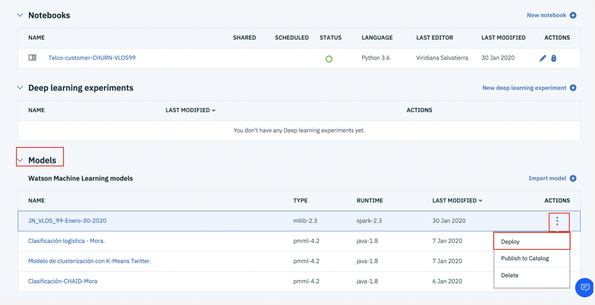
2.	Una vez que hemos sido redireccionados a la página del modelo, en la pestaña “Deployments”, damos clic en “Add Deployment”. 
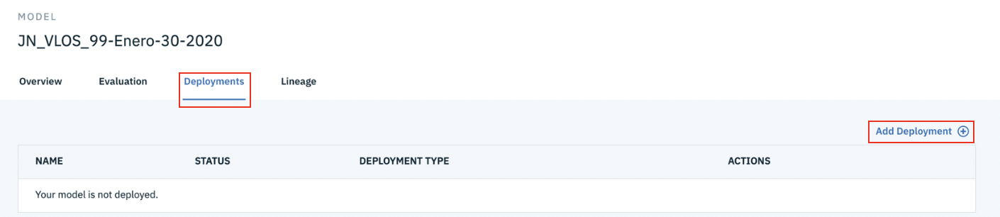
3.	Ahora, le damos un nombre a nuestro despliegue, después, en “Deployment type”, seleccionamos la opción “Web service” y damos clic en “Save”.
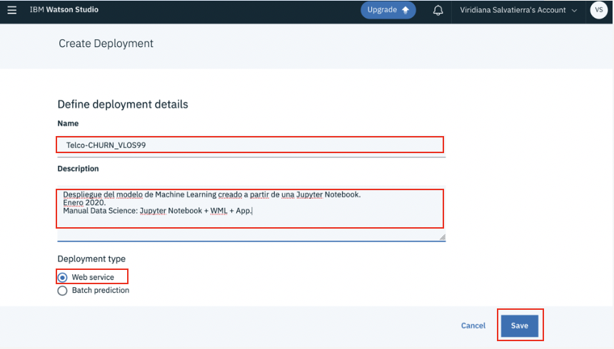
4.	Ahora podemos visualizar nuestro despliegue dentro de la página de nuestro modelo, en el apartado “Deployments”. Cuando el “status” cambie a “DEPLOY_SUCCESS”, nuestro modelo habrá sido desplegado exitosamente. (Si no cambia el “status” en un par de minutos, te recomendamos refrescar la página.)
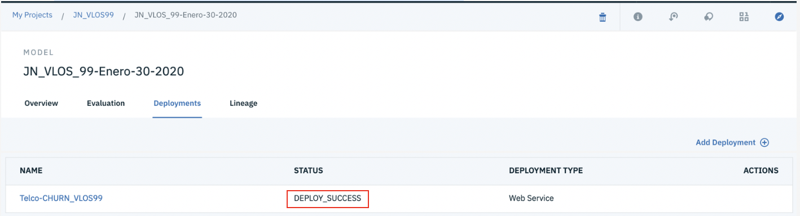

## 10. Probar el modelo:
1.	Una vez que desplegamos el modelo, damos clic en el nombre de nuestro despliegue.
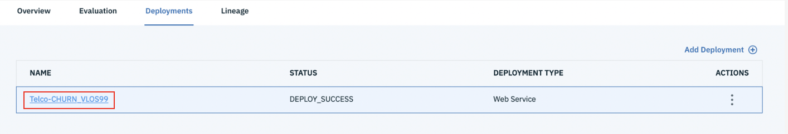

2.	Una vez dentro de la página de nuestro despliegue, damos clic en la pestaña “Test” y seleccionamos la opción “Provide imput data as JSON”.
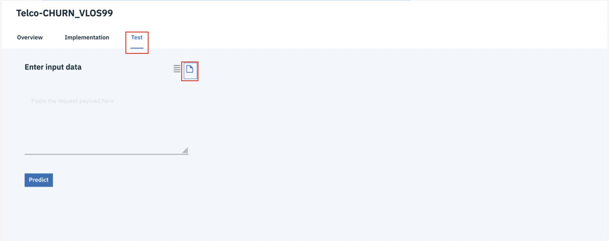

3.	Ahora, en el apartado “Paste the request payload here”, pegamos lo siguiente:
###
         1.	      {
         2.	         "fields":[
         3.	            "gender",
         4.	            "SeniorCitizen",
         5.	            "Partner",
         6.	            "Dependents",
         7.	            "tenure",
         8.	            "PhoneService",
         9.	            "MultipleLines",
         10.	            "InternetService",
         11.	            "OnlineSecurity",
         12.	            "OnlineBackup",
         13.	            "DeviceProtection",
         14.	            "TechSupport",
         15.	            "StreamingTV",
         16.	            "StreamingMovies",
         17.	            "Contract",
         18.	            "PaperlessBilling",
         19.	            "PaymentMethod",
         20.	            "MonthlyCharges",
         21.	            "TotalCharges"
         22.	         ],
         23.	         "values":[
         24.	            [
         25.	               "Female",
         26.	               0,
         27.	               "No",
         28.	               "No",
         29.	               1,
         30.	               "No",
         31.	               "No phone service",
         32.	               "DSL",
         33.	               "No",
         34.	               "No",
         35.	               "No",
         36.	               "No",
         37.	               "No",
         38.	               "No",
         39.	               "Month-to-month",
         40.	               "No",
         41.	               "Bank transfer (automatic)",
         42.	               25.25,
         43.	               25.25
         44.	            ]
         45.	         ]
         46.	      }
Y  damos clic en “Predict”.
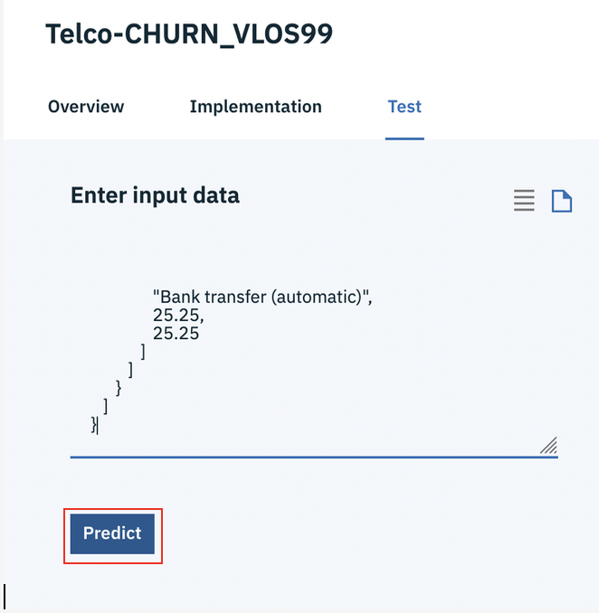

4.	Ahora, Podemos visualizar el resultado de nuestra predicción en formato JSON. Al final, debemos poder ver un “Yes” o un “No” como valor correspondiente al “CHURN”.
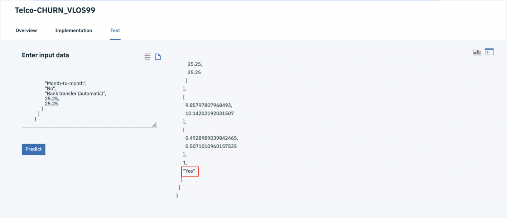

5.	Para poder probarlo realizando un “Post” desde la CMD, Terminal, PowerShell, etc., primero debemos obtener la apikey de nuestro servicio de “Watson Machine Learning” desde la página de nuestra instancia. En el apartado de “Service Credentials”, desplegamos las credenciales creadas anteriormente y copiamos la apikey.
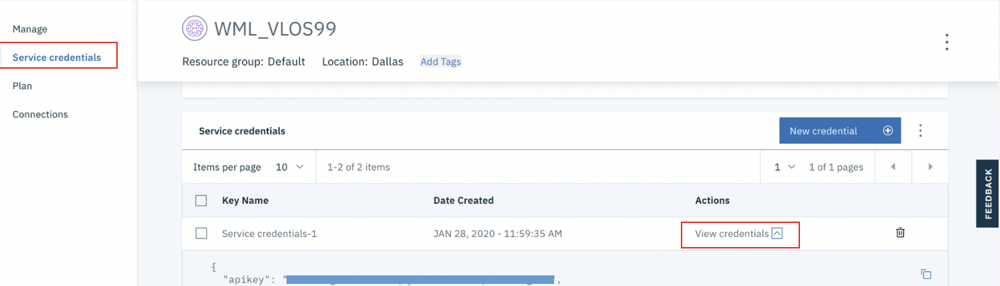
6.	Ahora debemos obtener un Token pegando lo siguiente en la CMD, la Terminal, PowerShell (modo administrador). 
### 
      curl -k -X POST \
      --header "Content-Type: application/x-www-form-urlencoded" \
      --header "Accept: application/json" \
      --data-urlencode "grant_type=urn:ibm:params:oauth:grant-type:apikey" \
      --data-urlencode "apikey=(escribe aquí la clave de apikey sin espacios ni paréntesis)" \
      "https://iam.bluemix.net/identity/token"
7.	Ahora obtenemos nuestro URL desde la página del despliegue de nuestro proyecto. Dentro de la página de nuestro proyecto, en la pestaña de “Assets”, damos clic en el nombre de nuestro modelo (desde el apartado “Models”).
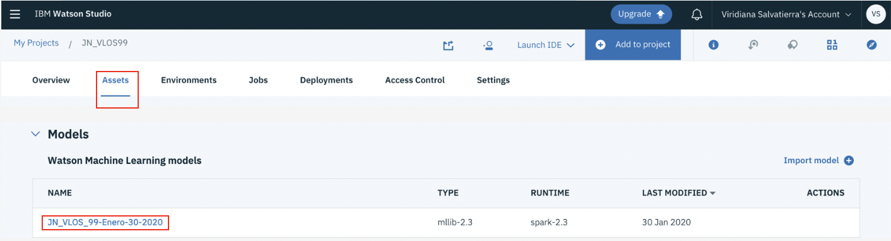

8.	Una vez dentro de nuestro modelo, en la pestaña “Deployments”, damos clic en el mobre de nuestro despliegue.
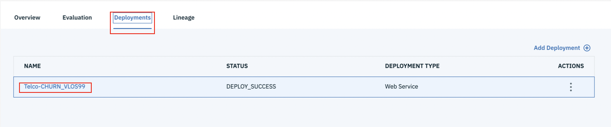

9.	Una vez dentro de muestro despliegue, copiamos la dirección de URL.
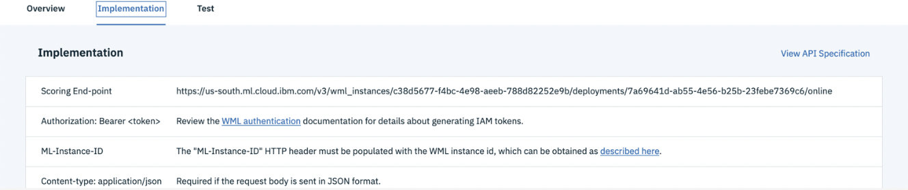

10.	Ahora, reemplazamos el access token resultante y la URL en donde corresponde e introducimos los comandos siguientes en la Terminal, CMD, etc.:
###
      export WML_AUTH_TOKEN=<sustituir por “access token” sin espacios ni flechas>
      export URL=https://<sustituir por el URL de WML sin espacios ni flechas>
11.	Una vez que hemos exportado estos valores, realizamos la consulta introduciendo lo siguiente en nuestra Terminal, CMD, etc.:
###
      curl -k -X POST --header 'Content-Type: application/json' --header 'Accept: application/json' --header "Authorization: Bearer  $WML_AUTH_TOKEN" -d '{"fields": ["gender","SeniorCitizen","Partner","Dependents","tenure","PhoneService","MultipleLines","InternetService","OnlineSecurity","OnlineBackup","DeviceProtection","TechSupport","StreamingTV","StreamingMovies","Contract","PaperlessBilling","PaymentMethod","MonthlyCharges","TotalCharges"],"values": [["Female",0,"No","No",1,"No","No phone service","DSL","No","No","No","No","No","No","Month-to-month","No","Bank transfer (automatic)",25.25,25.25]]}' $URL
12.	Hecho esto, obtendremos el resultado de nuestra consulta como un “YES” o “NO” al final de nuestros resultados.
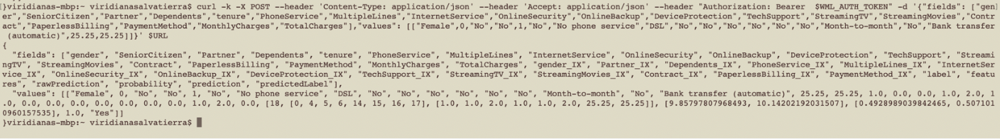
## 11. Desplegar la App:
1.	Antes de empezar, es muy importante haber clonado el repositorio requerido en los pre-requisitos, además de tener instalado Python 3.
2.	Accedemos a la carpeta (descomprimida) en la Terminal, CMD, etc
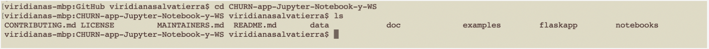
3.	Ahora, creamos nuestro ambiente (“enviroment”).
  ###
        python -m venv venv  
	      source venv/bin/activate  (Mac / Linux)
	      ./venv/Scripts/activate   (Windows)
4.	Instalamos los requerimientos de Python.
###
        cd flaskapp
        pip install -r requirements.txt
5.	Ahora, editamos el archivo “env.sample”, le añadimos nuestras credenciales y lo guardamos como “.env” (Si llegas a tener errores al correr la app, vuelve a sacar el token y cámbialo en el archivo “.env”, pues es temporal).
###
        # Copy this file to .env.
        # Edit the .env file with the required settings before starting the app.
        # Required: Provide your web service URL for scoring.
        # E.g., URL=https://9.10.222.3:31843/dmodel/v1/project/pyscript/tag/score
        URL=(aquí pegamos el URL que obtuvimos en el paso 8.7 sin paréntesis)

        # Required: Provide your web service deployment access token.
        #           This TOKEN will be the part after `accessToken`. So, your
        #           json string will look like:
        #           {"username":"scottda","role":"Admin","permissions":["administrator","can_provision","manage_catalog","virtualize_transform","access_catalog"],"sub":"scottda","iss":"KNOXSSO","aud":"DSX","uid":"1000331001","authenticator":"default","accessToken":"eyJhbGciOiJSUzI1NiIsInR5cCI6IkpXVCJ9.eyJ1c2 <snip> neQ","_messageCode_":"success","message":"success"}
        # The value for `TOKEN=` below will be:
        #    TOKEN=eyJhbGciOi <snip> neQ

        TOKEN=(aquí pegamos el token que obtuvimos en el paso 8.6 sin paréntesis)

        # Optional: You can override the server's host and port here.

        HOST=0.0.0.0
        PORT=5000
6.	Una vez hecho esto, corremos nuestra app con el siguiente comando:
###
        python telcochurn.py
7.	Ahora podemos acceder a nuestra app de forma local, pegando en el navegador lo siguiente: http://0.0.0.0:5000/
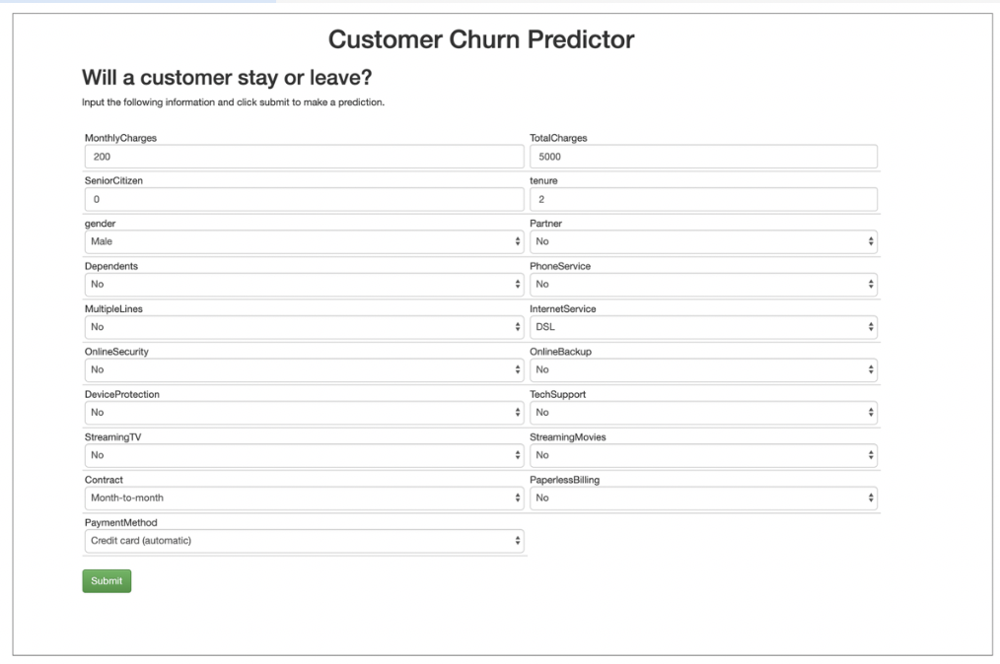
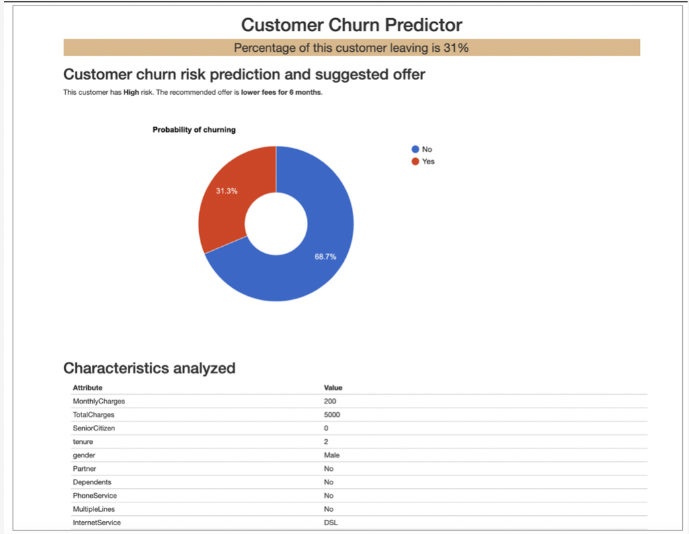

[url-academic]: https://my15.digitalexperience.ibm.com/b73a5759-c6a6-4033-ab6b-d9d4f9a6d65b/dxsites/151914d1-03d2-48fe-97d9-d21166848e65/home/
[img-ibmcloud-powered]: https://img.shields.io/badge/IBM%20Cloud-Powered-blue.svg
[url-ibmcloud]: https://www.ibm.com/cloud/

Y listo!

Te invitamos a explorar otros talleres y manuales en el siguiente enlace de Github.
https://github.com/ibmdevelopermx

