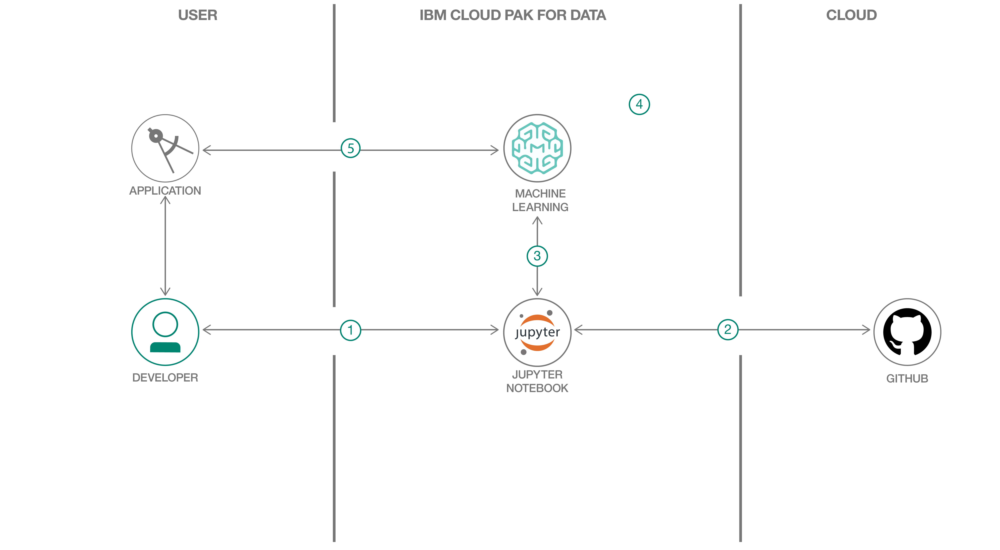

# Data Science Serie
En este bootcamp conoceras las herramientas de IBM Cloud, que te permitiran descubrir patrones, construir predicciones usando información y tecnicas de Machine Learning e Inteligencia Artificial.

Estas herramientas las encontraras en [![IBM Cloud Powered][img-ibmcloud-powered]][url-ibmcloud]

Puedes encontrar más información de **IBM Data Science** en [![IBM Data Science][img-ibmcloudds]][url-ibmcloudds]

**Predecir la pérdida de clientes con Watson Machine Learning y las notebooks Jupyter en Cloud Pak para datos**

En este patrón de código, utilizamos **IBM Watson Studio** para pasar por toda la tubería de ciencia de datos para resolver un problema comercial y predecir la pérdida de clientes utilizando un conjunto de datos de pérdida de clientes de Telco.

Aprenderas a:

   * Usar los cuadernos Jupyter para cargar, visualizar y analizar datos.
   * Ejecutar cuadernos en IBM Watson Studio para datos.
   * Crear, probar e implementar un modelo de aprendizaje automático utilizando Spark MLib en Watson Studio.
   * Implementar un modelo de aprendizaje automático seleccionado para la producción usando Watson Studio
   * Crear una aplicación front-end para interactuar con el cliente y comenzar a consumir su modelo implementado.

## Flujo

* El usuario carga el Jupyter notebook en la plataforma Watson Studio.
* El conjunto de datos de abandono de clientes de Telco se carga en el Jupyter Notebook, ya sea directamente desde el repositorio de github o como Datos virtualizados después de seguir el Tutorial de virtualización de datos de IBM Watson Studio para la Ruta de aprendizaje de datos.
* Preprocese los datos, cree modelos de aprendizaje automático y guárdelos en Watson Machine Learning en Watson studio.
* Implemente un modelo de aprendizaje automático seleccionado en producción en la plataforma Watson Studio y obtenga un punto final de puntuación.
* Use el modelo para la predicción de crédito utilizando una aplicación frontend.

Para **Data Science**, **IBM Cloud** tiene herramientas como:
* [![Watson Studio][img-WS]][url-WS] Que simplifica y escala la ciencia de datos para predecir y optimizar el porvenir de los negocios.

* [![IBM Cloud Watson Machine Learning Accelerator][img-machine]][url-machine] Que hace que el deep learning y el machine learning sean más accesibles para su personal y proporciona los beneficios de la IA a su negocio.

* Jupyter Notebooks: una aplicación web de código abierto que le permite crear y compartir documentos que contienen código en vivo, ecuaciones, visualizaciones y texto explicativo.

* Pandas: una biblioteca de código abierto que proporciona estructuras de datos de alto rendimiento y herramientas de análisis de datos fáciles de usar para el lenguaje de programación Python.

* Seaborn: una biblioteca de visualización de datos de Python basada en matplotlib. Proporciona una interfaz de alto nivel para dibujar gráficos estadísticos atractivos e informativos.

* Spark MLib: la biblioteca escalable de aprendizaje automático de Apache Spark.

## Pre-requisitos
* Tener instalado [**github Desktop**](https://desktop.github.com) o [**git cli**](https://git-scm.com/book/en/v2/Getting-Started-Installing-Git).
* Tener instalado el [**CLI de IBM Cloud**](https://cloud.ibm.com/docs/cli?topic=cloud-cli-getting-started) (Si tienes problemas con este paso, da clic [**aquí**](https://cloud.ibm.com/docs/cli?topic=cloud-cli-install-ibmcloud-cli) para descargar la versión “STANDALONE”).
* Descargar el repositorio del siguiente [**enlace**](https://github.com/ibmdevelopermx/DataScience).

## Data Science-Lab 1
Aprende en este laboratorio a crear una instancia de Watson Studio y cargar un dataset:

[IBM Data Science Lab 1][url-lab1]

[url-lab1]: /Data_Science-Lab-1

## Data Science-Lab 2
Aprende a crear un modelo en un Jupiter Notebook dentro de Watson Studio:

[IBM Data Science Lab 2][url-lab2]

[url-lab2]: /Data-Science-Lab-2

## Data Science-Lab 3
Aprende a desplegar un modelo de un Jupiter Notebook dentro de Watson Studio:

[IBM Data Science Lab 3][url-lab3]

[url-lab3]: /Data-Science-Lab-3

**Te invitamos a explorar otros talleres y manuales en el siguiente enlace de Github.**
https://github.com/ibmdevelopermx

## Cupones para profesores y estudiantes:

* Acceder al portal de [IBM Academic Initiative][url-academic] y seleccionar la opción "Register now" si aun no tienes cuenta.
* Realizar el registro correspondiente utilizando la cuenta de correo académica y confirma tu cuenta.
* Despues de confirmar tu cuenta, y con la sesion iniciada en IBM Academic Initiative, en la parte de "Most Popular Topics covered", encontraremos **IBM Cloud** y damos clic en "Learn more".
* Bajamos de la pagina hasta encontrar "Software". Le damos clic, nos dara un apartado que se llama "Request Feature Code".
* Nos dara nuestro codigo. Lo copiamos y lo llevamos a **IBM Cloud**.

## Cargar créditos en IBM Cloud:

* En la parte superior derecha, buscaremos la parte de "MANAGE"/"GESTIONAR", nos desplegara una lista y seleccionaremos "Account"/"Cuenta".
* De lado izquierdo, tendremos una opción "Account settings"/"Configuracion de cuenta".
* Bajamos un poco hasta encontrar "Subscription and feature codes"/"Codigos de suscripción y carateristicas".
* Da clic en "Apply code"/"Aplicar codigo".
* Ingresamos el codigo y clic en "Apply"/"Aplicar".

[img-ibmcloud-powered]: https://img.shields.io/badge/IBM%20Cloud-Powered-blue.svg
[url-ibmcloud]: https://www.ibm.com/cloud/
[img-ibmcloudds]: https://img.shields.io/badge/IBM%20Cloud-Data%20Science-blue.svg
[url-ibmcloudds]: https://www.ibm.com/analytics/data-science
[img-WS]: https://img.shields.io/badge/IBM%20Cloud-Watson%20Studio-9cf.svg
[url-WS]:https://www.ibm.com/cloud/watson-studio
[img-visual]: https://img.shields.io/badge/IBM%20Cloud-Watson%20Visual%20Recongnition-9cf.svg
[url-visual]: https://www.ibm.com/cloud/watson-visual-recognition
[img-machine]: https://img.shields.io/badge/IBM%20Cloud-Watson%20Machine%20Learning%20Accelerator-9cf.svg
[url-machine]: https://www.ibm.com/us-en/marketplace/deep-learning-platform
[url-academic]: https://my15.digitalexperience.ibm.com/b73a5759-c6a6-4033-ab6b-d9d4f9a6d65b/dxsites/151914d1-03d2-48fe-97d9-d21166848e65/home/
